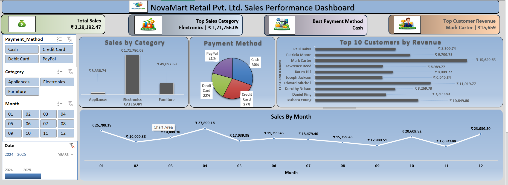

# NovaMart Retail Sales Performance Dashboard 

## 📌 Project Overview
This project presents an interactive **Sales Performance Dashboard** built using Microsoft Excel for **NovaMart Retail Pvt. Ltd.**  
The dashboard provides a comprehensive view of sales trends, customer performance, product categories, and payment methods to support data-driven business decisions.

---

## 🧾 Objective
- Analyze retail sales data efficiently
- Track monthly sales performance
- Identify top-performing categories and customers
- Understand customer payment preferences
- Provide clear business insights through visualization

---

## 🧰 Tools & Techniques Used
- Microsoft Excel
- Pivot Tables & Pivot Charts
- Slicers (Interactive Filters)
- Excel Formulas
- Dashboard Design & Formatting
- What-If Analysis
- Linear Regression (Trend Analysis)

---

## 📊 Key Dashboard Metrics
- **Total Sales:** ₹2,29,192.47  
- **Top Sales Category:** Electronics (₹1,71,756.05)  
- **Best Payment Method:** Cash  
- **Top Customer by Revenue:** Mark Carter (₹15,659)

---

## 📈 Visualizations Included
- Sales by Category (Column Chart)
- Payment Method Distribution (Pie Chart)
- Top 10 Customers by Revenue (Bar Chart)
- Monthly Sales Trend (Line Chart)

---

## 🎛️ Interactive Filters (Slicers)
- Payment Method (Cash, Credit Card, Debit Card, PayPal)
- Product Category (Appliances, Electronics, Furniture)
- Month (01–12)
- Year (2024–2025)

## 📸 Dashboard Preview

